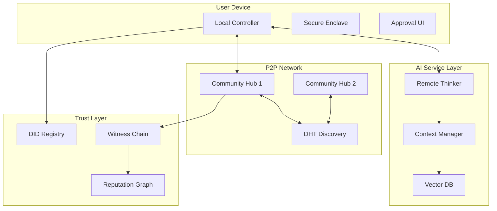

# AI-First CivicForge: Technical Specification

## System Architecture

### Component Overview



## Core Components

### 1. Local Controller Specification

#### API Interface
```typescript
interface LocalController {
  // Identity Management
  initializeIdentity(): Promise<DID>
  getIdentity(): DID
  
  // Agent Authorization
  authorizeAgent(
    agentEndpoint: string,
    permissions: Permission[],
    duration: Duration
  ): Promise<VerifiableCredential>
  
  // Action Approval
  reviewAction(proposal: ActionProposal): Promise<ApprovalDecision>
  signAction(action: Action): Promise<SignedAction>
  
  // Preference Management
  updateConstitution(values: CivicValues): Promise<void>
  getConstitution(): CivicValues
}

interface ActionProposal {
  id: string
  type: 'CREATE_QUEST' | 'CLAIM_QUEST' | 'SUBMIT_WORK' | 'ATTEST'
  summary: string
  details: any
  requiredSignatures: SignatureRequirement[]
  expiresAt: Date
}

interface ApprovalDecision {
  approved: boolean
  signature?: string
  reason?: string
  modifications?: any
}
```

#### Local Storage Schema
```sql
-- Identity storage
CREATE TABLE identity (
  did TEXT PRIMARY KEY,
  private_key_encrypted BLOB,
  created_at TIMESTAMP
);

-- Agent authorizations
CREATE TABLE agent_auth (
  id TEXT PRIMARY KEY,
  agent_endpoint TEXT,
  permissions JSON,
  valid_until TIMESTAMP,
  credential JSON
);

-- Action history
CREATE TABLE action_log (
  id TEXT PRIMARY KEY,
  action_type TEXT,
  action_data JSON,
  signature TEXT,
  timestamp TIMESTAMP,
  agent_id TEXT
);

-- User preferences
CREATE TABLE constitution (
  key TEXT PRIMARY KEY,
  value JSON,
  updated_at TIMESTAMP
);
```

### 2. Remote Thinker Specification

#### Core Capabilities
```python
class RemoteThinker:
    def __init__(self, user_did: str, auth_credential: VerifiableCredential):
        self.user_did = user_did
        self.auth = auth_credential
        self.llm = PowerfulLLM()  # GPT-4+ class
        self.guard_llm = GuardLLM()  # Smaller model for safety checks
        self.context = UserContextManager(user_did)
        self.privacy_guard = PrivacyGuard(user_did)
    
    async def process_need(self, user_input: str) -> ActionProposal:
        """Convert natural language to structured action proposal"""
        # Safety check first
        if not await self.guard_llm.is_safe_input(user_input):
            raise SecurityException("Input failed safety check")
        
        # Sanitize and structure input
        structured_input = await self.sanitize_input(user_input)
        
        # Understand intent with instructional fences
        intent = await self.llm.analyze_intent(
            f"<system>Analyze user intent</system>\n<user_input>{structured_input}</user_input>"
        )
        
        # Gather context
        context = await self.context.get_relevant_context(intent)
        
        # Formulate action
        action = await self.llm.create_action(intent, context)
        
        # Create proposal for user approval
        return self.create_proposal(action)
    
    async def discover_opportunities(self) -> List[Opportunity]:
        """Proactively find relevant quests"""
        # Get user interests and availability
        profile = await self.context.get_user_profile()
        
        # Query P2P network
        quests = await self.p2p_client.search_quests(profile.interests)
        
        # Score and rank
        scored = await self.llm.score_relevance(quests, profile)
        
        return sorted(scored, key=lambda x: x.score, reverse=True)[:10]
    
    async def negotiate(self, quest_id: str, terms: Terms) -> NegotiationResult:
        """Conduct AI-to-AI negotiation"""
        # Connect to other agent
        other_agent = await self.p2p_client.connect_to_quest_owner(quest_id)
        
        # Exchange proposals
        # Template-based negotiation only
        negotiation_template = await self.get_negotiation_template(quest_id)
        
        while not agreement_reached and rounds < MAX_ROUNDS:
            proposal = await self.create_structured_proposal(
                current_state, negotiation_template
            )
            response = await other_agent.evaluate_proposal(proposal)
            current_state = await self.process_structured_response(response)
            rounds += 1
        
        # Human approval required
        final_terms = await self.prepare_for_human_approval(current_state)
        return final_terms  # Not finalized until human approves
```

#### Context Management
```python
class UserContextManager:
    def __init__(self, user_did: str):
        self.user_did = user_did
        self.vector_db = VectorDatabase()
        self.conversation_memory = ConversationMemory()
    
    async def add_interaction(self, interaction: Interaction):
        # Extract embeddings
        embeddings = await self.embed_interaction(interaction)
        
        # Store in vector DB
        await self.vector_db.add(
            embeddings=embeddings,
            metadata={
                'user_did': self.user_did,
                'timestamp': interaction.timestamp,
                'type': interaction.type
            }
        )
        
        # Update conversation memory
        await self.conversation_memory.append(interaction)
    
    async def get_relevant_context(self, query: str) -> Context:
        # Semantic search
        similar = await self.vector_db.search(
            query_embedding=await self.embed_text(query),
            filter={'user_did': self.user_did},
            top_k=20
        )
        
        # Get recent interactions
        recent = await self.conversation_memory.get_recent(days=7)
        
        # Combine and summarize
        return Context(
            relevant_history=similar,
            recent_activity=recent,
            user_preferences=await self.get_preferences()
        )
```

### 3. P2P Network Protocol

#### Agent Discovery Protocol
```protobuf
// Agent announcement message
message AgentAnnounce {
  string agent_id = 1;
  repeated string capabilities = 2;
  repeated string interests = 3;
  string public_key = 4;
  int64 timestamp = 5;
  bytes signature = 6;
}

// Quest broadcast message
message QuestBroadcast {
  string quest_id = 1;
  string semantic_hash = 2;  // DHT key
  QuestMetadata metadata = 3;
  string creator_agent = 4;
  int64 timestamp = 5;
  bytes signature = 6;
}

// Agent-to-agent negotiation
message NegotiationMessage {
  string session_id = 1;
  string from_agent = 2;
  string to_agent = 3;
  oneof content {
    Proposal proposal = 4;
    CounterOffer counter = 5;
    Agreement agreement = 6;
    Rejection rejection = 7;
  }
  bytes signature = 8;
}
```

#### DHT-based Discovery
```go
// Community Hub implementation
type CommunityHub struct {
    dht        *kaddht.IpfsDHT
    datastore  ds.Batching
    peerstore  peerstore.Peerstore
    reputation *ReputationManager
}

func (h *CommunityHub) PublishQuest(quest *Quest) error {
    // Generate semantic keys
    keys := generateSemanticKeys(quest)
    
    // Sign the quest data
    signed := h.signData(quest)
    
    // Publish to DHT under multiple keys
    for _, key := range keys {
        ctx := context.Background()
        err := h.dht.PutValue(ctx, key, signed)
        if err != nil {
            return err
        }
    }
    
    // Pin locally for availability
    return h.datastore.Put(quest.ID, signed)
}

func (h *CommunityHub) SearchQuests(criteria SearchCriteria) ([]*Quest, error) {
    var quests []*Quest
    
    // Generate search keys from interests
    searchKeys := generateSearchKeys(criteria.Interests)
    
    // Add serendipity keys if enabled
    if criteria.SerendipityLevel > 0 {
        randomKeys := h.generateSerendipityKeys(criteria)
        searchKeys = append(searchKeys, randomKeys...)
    }
    
    // Query DHT
    for _, key := range searchKeys {
        ctx := context.Background()
        val, err := h.dht.GetValue(ctx, key)
        if err == nil {
            quest := &Quest{}
            if err := quest.Unmarshal(val); err == nil {
                quests = append(quests, quest)
            }
        }
    }
    
    // Apply community priority boost
    quests = h.boostCommunityPriorities(quests)
    
    // Filter by reputation and diversity
    filtered := h.reputation.FilterQuests(quests)
    return h.ensureDiversity(filtered, criteria), nil
}
```

### 4. Trust Protocol Implementation

#### DID Document Structure
```json
{
  "@context": "https://www.w3.org/ns/did/v1",
  "id": "did:civic:user123",
  "authentication": [{
    "id": "did:civic:user123#keys-1",
    "type": "Ed25519VerificationKey2020",
    "controller": "did:civic:user123",
    "publicKeyMultibase": "z6MkpTHR8VNsBxYAAWHut2Geadd9jSwuBV8xRoAnwWsdvktH"
  }],
  "service": [{
    "id": "did:civic:user123#agent",
    "type": "CivicAgent",
    "serviceEndpoint": "https://agent.civicforge.org/user123"
  }],
  "civicProfile": {
    "reputation": 850,
    "questsCompleted": 47,
    "attestationsReceived": 94,
    "joinedAt": "2025-01-15T00:00:00Z"
  }
}
```

#### Verifiable Credential for Agent Authorization
```json
{
  "@context": [
    "https://www.w3.org/2018/credentials/v1",
    "https://civicforge.org/contexts/agent-auth/v1"
  ],
  "type": ["VerifiableCredential", "AgentAuthorizationCredential"],
  "issuer": "did:civic:user123",
  "issuanceDate": "2025-06-26T00:00:00Z",
  "expirationDate": "2025-07-26T00:00:00Z",
  "credentialSubject": {
    "id": "did:civic:agent456",
    "authorizedActions": [
      "DISCOVER_QUESTS",
      "PROPOSE_ACTIONS",
      "NEGOTIATE_TERMS"
    ],
    "scopeRestrictions": {
      "questCategories": ["environmental", "education"],
      "maxReputationRisk": 50,
      "requiresApproval": ["CLAIM_QUEST", "SUBMIT_WORK"]
    }
  },
  "proof": {
    "type": "Ed25519Signature2020",
    "created": "2025-06-26T00:00:00Z",
    "proofPurpose": "assertionMethod",
    "verificationMethod": "did:civic:user123#keys-1",
    "proofValue": "z58DAdFfa9SkqZMVPxAQp..."
  }
}
```

### 5. Implementation Milestones

#### Phase 1: MVP (Month 1-3)
```yaml
Month 1:
  - Local Controller core implementation
  - Basic DID integration
  - Simple approval UI
  
Month 2:
  - Remote Thinker prototype
  - LLM integration for intent analysis
  - Basic action proposal system
  
Month 3:
  - Controller-Thinker communication
  - End-to-end quest creation flow
  - Security audit
```

#### Phase 2: P2P Foundation (Month 4-6)
```yaml
Month 4:
  - libp2p integration
  - DHT implementation
  - Basic peer discovery
  
Month 5:
  - Community Hub prototype
  - Quest publishing/searching
  - Sybil resistance mechanisms
  
Month 6:
  - Agent-to-agent messaging
  - Simple negotiation protocol
  - Network stress testing
```

#### Phase 3: Advanced Features (Month 7-12)
```yaml
Month 7-8:
  - Natural language processing improvements
  - Semantic quest matching
  - Context-aware recommendations
  
Month 9-10:
  - Cryptographic attestations
  - Reputation calculation
  - Dispute resolution
  
Month 11-12:
  - Mobile app development
  - Performance optimization
  - Community deployment
```

## Development Guidelines

### Security Best Practices
1. Never expose private keys outside secure enclave
2. All network communication must be encrypted
3. Rate limit all API endpoints
4. Implement circuit breakers for external services
5. Regular security audits of agent code

### Privacy Principles
1. Data minimization by default
2. User consent for all data sharing
3. Right to deletion at any time
4. Encrypted storage for sensitive data
5. No behavioral tracking without consent

### Testing Strategy
```bash
# Unit tests for each component
npm test

# Integration tests
npm run test:integration

# P2P network simulation
npm run test:network

# Security penetration testing
npm run test:security

# Load testing with 10k agents
npm run test:load
```

### Deployment Architecture
```yaml
Production:
  Local Controller:
    - App stores (iOS, Android)
    - Auto-updates with user consent
    - Crash reporting (privacy-safe)
    
  Remote Thinker:
    - Multi-region deployment
    - Auto-scaling based on load
    - GPU instances for LLM inference
    
  Community Hubs:
    - Kubernetes deployment
    - Geographic distribution
    - Automated backup/recovery
    
  Monitoring:
    - OpenTelemetry for observability
    - Grafana dashboards
    - PagerDuty for incidents
```

## Conclusion

This technical specification provides a concrete roadmap for implementing the AI-first CivicForge vision. By following these specifications and milestones, we can build a system that truly puts AI at the driver's seat of civic engagement while maintaining user sovereignty and privacy.