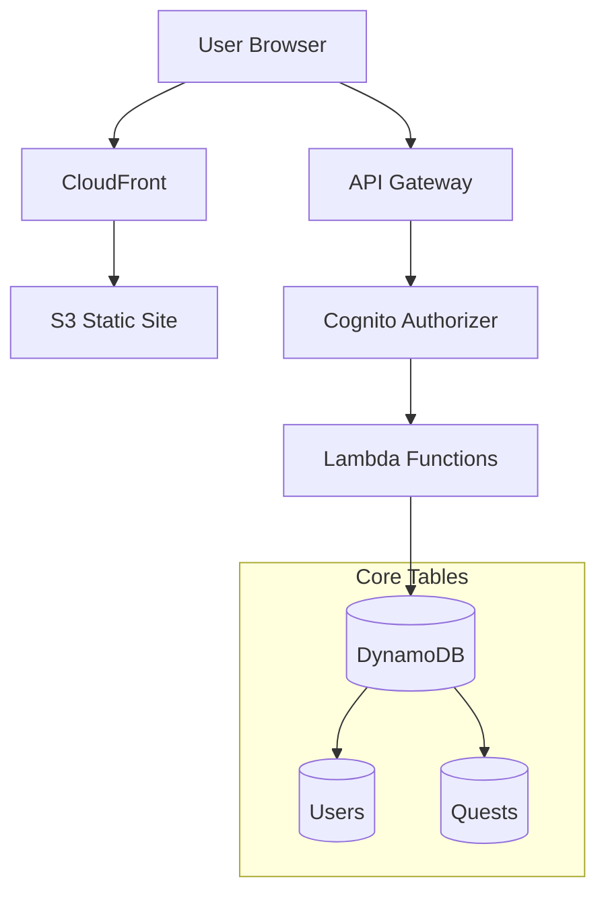

# CivicForge Architecture

## Core Mission & Principles

**Mission:** Enable peer-to-peer trust through dual-attestation of community quests.

**Principles:**
1. **Security over Performance** - Every attestation must be cryptographically verifiable
2. **Stateless by Default** - All state lives in DynamoDB, Lambdas are ephemeral
3. **Verifiability is Paramount** - The public must be able to audit completed quests

## System Architecture



## Core Flow: The Dual-Attestation Lifecycle

1. **Quest Creation**: A community member (requestor) creates a quest describing needed work
2. **Quest Claiming**: Another member (performer) claims the quest, committing to complete it
3. **Work Submission**: Performer completes the work and submits evidence
4. **Dual Attestation**: 
   - Performer attests: "I completed this work as specified"
   - Requestor attests: "The work meets my requirements"
5. **Completion**: When both attestations are recorded, the quest moves to COMPLETE status
6. **Rewards**: XP and reputation are awarded to the performer

### State Transitions

```
OPEN → CLAIMED → SUBMITTED → COMPLETE
         ↓           ↓
      EXPIRED    DISPUTED
```

## Key Technology Choices

### Why Serverless?
- **Scale to zero**: Community projects have variable load
- **No server management**: Focus on features, not infrastructure
- **Pay per use**: Keeps costs minimal for community-driven project

### Why DynamoDB?
- **Single-table design**: All data in one table with GSIs for access patterns
- **Atomic transactions**: Critical for state transitions and attestations
- **Serverless-native**: No connection pooling issues with Lambda

### Why TypeScript?
- **Type safety**: Prevents entire classes of bugs in distributed systems
- **Shared types**: Frontend and backend share the same interfaces
- **Developer experience**: Better IDE support and refactoring

## Data Models

### User
- `userId` (PK): Cognito sub
- `username`: Display name
- `reputation`: Earned through completed quests
- `experience`: XP accumulated

### Quest
- `questId` (PK): UUID
- `status`: Current state in lifecycle
- `creatorId`: User who created the quest
- `performerId`: User who claimed it
- `attestations`: Array of attestation records

### Attestation
- `userId`: Who is attesting
- `role`: "requestor" or "performer"
- `timestamp`: When attested
- `signature`: Future - cryptographic proof