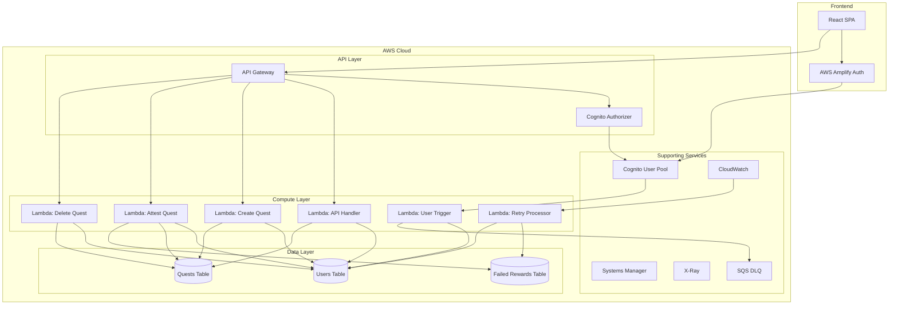

# CivicForge Architecture Overview

*Last Updated: January 17, 2025*

## System Architecture

CivicForge is built on a serverless architecture using AWS services, with a React frontend and Python/FastAPI backend.

## Component Breakdown

### Frontend (React SPA)
- **Technology**: React 18, TypeScript, Vite
- **State Management**: React hooks, Context API
- **Authentication**: AWS Amplify integration
- **Testing**: Vitest, React Testing Library, MSW
- **Styling**: CSS modules
- **Key Features**:
  - Quest browsing and filtering
  - Quest creation interface
  - Work submission modal
  - Dual-attestation UI
  - User profile management

### API Gateway
- **Type**: HTTP API (not REST API)
- **Authentication**: Cognito JWT authorizer
- **Rate Limiting**: 100 req/s, 200 burst
- **CORS**: Configured for frontend domain
- **Monitoring**: X-Ray tracing enabled

### Lambda Functions

#### 1. API Handler (`handlers.api`)
- **Purpose**: Handles most read operations and non-critical updates
- **Endpoints**:
  - GET /health (public)
  - GET /api/v1/quests
  - GET /api/v1/quests/{quest_id}
  - POST /api/v1/quests/{quest_id}/claim
  - POST /api/v1/quests/{quest_id}/submit
  - GET /api/v1/users/{user_id}
  - PUT /api/v1/users/wallet
- **IAM**: Read access to all tables, limited updates

#### 2. Create Quest (`handlers.create_quest`)
- **Purpose**: Critical operation involving point deduction
- **Endpoint**: POST /api/v1/quests
- **IAM**: Specific attribute updates on Users table
- **Business Logic**: Validates user has sufficient points

#### 3. Attest Quest (`handlers.attest_quest`)
- **Purpose**: Dual-attestation verification and reward distribution
- **Endpoint**: POST /api/v1/quests/{quest_id}/attest
- **IAM**: Update specific user attributes, write to failed rewards
- **Features**: Optional cryptographic signature verification

#### 4. Delete Quest (`handlers.delete_quest`)
- **Purpose**: Removes quest and refunds points
- **Endpoint**: DELETE /api/v1/quests/{quest_id}
- **IAM**: Delete from Quests, update user points

#### 5. User Creation Trigger (`src.triggers.create_user`)
- **Purpose**: Creates user record when Cognito user signs up
- **Trigger**: Cognito post-confirmation
- **Error Handling**: Failed attempts go to DLQ

#### 6. Failed Rewards Processor (`src.triggers.reprocess_failed_rewards`)
- **Purpose**: Retries failed reward distributions
- **Schedule**: Every 15 minutes
- **Pattern**: DynamoDB-based retry with exponential backoff

### Data Layer (DynamoDB)

#### Users Table
- **Partition Key**: userId (String)
- **Attributes**:
  - username, email, walletAddress
  - xp, reputation, questCreationPoints
  - processedRewardIds (Set)
- **Features**: Point-in-time recovery enabled

#### Quests Table
- **Partition Key**: questId (String)
- **Global Secondary Indexes**:
  - StatusIndex: (status, createdAt)
  - CreatorIndex: (creatorId, createdAt)
  - PerformerIndex: (performerId, createdAt)
- **States**: OPEN → CLAIMED → SUBMITTED → COMPLETE/DISPUTED

#### Failed Rewards Table
- **Partition Key**: failureId (String)
- **GSI**: status-createdAt-index
- **Purpose**: Tracks and retries failed reward distributions

## Data Flow Scenarios

### Quest Creation Flow
1. User submits quest form in React UI
2. API Gateway validates JWT token
3. CreateQuest Lambda checks user points
4. Atomically deducts points and creates quest
5. Returns quest details to frontend

### Dual-Attestation Flow
1. Performer submits completed work
2. Quest status changes to SUBMITTED
3. Both creator and performer can attest
4. Each attestation is recorded atomically
5. When both attest, quest becomes COMPLETE
6. Rewards distributed to performer
7. Failed rewards tracked for retry

### Authentication Flow
1. User registers via React UI
2. Cognito creates user account
3. Post-confirmation trigger fires
4. Lambda creates DynamoDB user record
5. User receives JWT tokens
6. Frontend stores tokens with Amplify

## Recent Architectural Changes

### Security Enhancements (January 2025)
1. **API Authentication**: All endpoints now require JWT tokens
2. **IAM Refinement**: Function-specific roles with least privilege
3. **CORS Configuration**: Properly configured for frontend domain

### Operational Improvements
1. **X-Ray Tracing**: End-to-end request tracing
2. **Structured Alarms**: DLQ monitoring, API error tracking
3. **Retry Mechanism**: Robust failed reward processing

## Design Principles

### 1. Separation of Concerns
- Each Lambda handles specific business domain
- Critical operations isolated in dedicated functions
- Clear boundaries between layers

### 2. Security First
- Default-deny API access
- Least privilege IAM policies
- Attribute-level DynamoDB restrictions

### 3. Resilience
- Idempotent operations where possible
- Atomic database operations
- Comprehensive error handling
- Automatic retry for transient failures

### 4. Observability
- Structured logging (pending enhancement)
- Distributed tracing with X-Ray
- CloudWatch metrics and alarms
- DLQ for failure visibility

### 5. Cost Optimization
- Pay-per-use pricing model
- Right-sized Lambda memory
- DynamoDB on-demand billing
- Efficient query patterns with GSIs

## Scalability Considerations

### Current Limits
- API Gateway: 10,000 requests per second
- Lambda: 1,000 concurrent executions
- DynamoDB: On-demand scales automatically

### Future Scaling Strategies
1. **Caching**: Add ElastiCache for read-heavy operations
2. **CDN**: CloudFront for static asset delivery
3. **Queue**: SQS for asynchronous processing
4. **Database**: Consider read replicas if needed

## Technology Decisions

### Why Serverless?
- No infrastructure management
- Automatic scaling
- Pay-per-use pricing
- Built-in high availability

### Why DynamoDB?
- Serverless, fully managed
- Consistent performance at scale
- Flexible schema for evolving requirements
- Strong consistency for critical operations

### Why Separate Lambda Functions?
- Fine-grained security control
- Independent scaling
- Isolated failure domains
- Clear operational boundaries

## Future Architecture Considerations

### Short Term
1. **API Versioning**: Implement versioning strategy
2. **WebSocket Support**: Real-time notifications
3. **Cache Layer**: Redis for session/query caching

### Long Term
1. **Microservices**: Split into domain services
2. **Event Sourcing**: Audit trail for all changes
3. **Multi-Region**: Geographic distribution
4. **GraphQL**: More flexible API layer