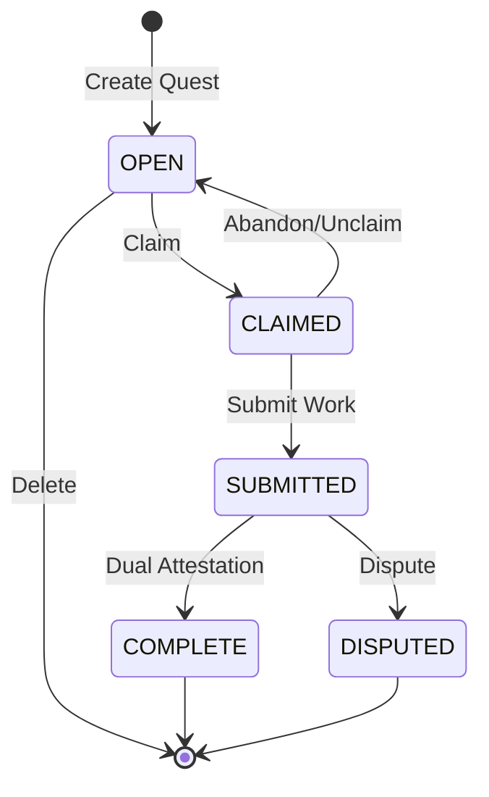

# Quest State Machine Explained

*Last Updated: January 2025*

## Overview

The Quest State Machine is the heart of CivicForge's business logic, managing the lifecycle of quests from creation to completion. This document explains the design philosophy, implementation details, and the reasoning behind our state management approach.

## Why a State Machine?

### The Problem
Quest lifecycle management involves complex rules:
- Who can perform which actions at what time?
- What are the valid state transitions?
- How do we prevent race conditions?
- How do we ensure data consistency?

### The Solution
A formal state machine provides:
- **Predictability**: All state transitions are explicitly defined
- **Security**: Invalid transitions are impossible by design
- **Clarity**: Business rules are centralized and testable
- **Auditability**: Every state change is traceable

## Quest States

### OPEN
- **Description**: Quest is available for claiming
- **Entry**: Quest creation
- **Exit**: When claimed by a performer
- **Allowed Actions**: View, Claim, Delete (by creator)

### CLAIMED
- **Description**: Quest is assigned to a performer
- **Entry**: Performer claims the quest
- **Exit**: Submission or abandonment
- **Allowed Actions**: Submit work, Abandon (by performer)

### SUBMITTED
- **Description**: Work has been submitted, awaiting attestation
- **Entry**: Performer submits work
- **Exit**: Dual attestation complete or dispute
- **Allowed Actions**: Attest (by creator/performer), Dispute

### COMPLETE
- **Description**: Both parties have attested to completion
- **Entry**: Both attestations received
- **Exit**: None (terminal state)
- **Allowed Actions**: View only

### DISPUTED
- **Description**: Disagreement about completion
- **Entry**: Either party disputes during SUBMITTED
- **Exit**: None (terminal state, requires manual resolution)
- **Allowed Actions**: View, Admin intervention

### EXPIRED (Planned)
- **Description**: Quest deadline passed without completion
- **Entry**: Automatic transition after deadline
- **Exit**: None (terminal state)
- **Allowed Actions**: View only

## State Transition Diagram



## Implementation Details

### Core State Machine Class

```python
class QuestStateMachine:
    """
    Manages quest state transitions and validates user actions.
    This is a pure business logic class with no database dependencies.
    """
    
    # Valid state transitions
    TRANSITIONS = {
        QuestStatus.OPEN: [QuestStatus.CLAIMED],
        QuestStatus.CLAIMED: [QuestStatus.SUBMITTED, QuestStatus.OPEN],
        QuestStatus.SUBMITTED: [QuestStatus.COMPLETE, QuestStatus.DISPUTED],
        QuestStatus.COMPLETE: [],  # Terminal state
        QuestStatus.DISPUTED: [],   # Terminal state
    }
```

### Validation Methods

The state machine provides validation methods for each user action:

#### Can User Claim?
```python
@staticmethod
def can_user_claim(quest: Quest, user_id: str) -> bool:
    """Check if user can claim the quest"""
    return (
        quest.status == QuestStatus.OPEN and
        quest.creatorId != user_id and  # Can't claim own quest
        quest.performerId is None        # Not already claimed
    )
```

#### Can User Submit?
```python
@staticmethod
def can_user_submit(quest: Quest, user_id: str) -> bool:
    """Check if user can submit work"""
    return (
        quest.status == QuestStatus.CLAIMED and
        quest.performerId == user_id  # Only performer can submit
    )
```

#### Can User Attest?
```python
@staticmethod
def can_user_attest(quest: Quest, user_id: str) -> bool:
    """Check if user can attest to completion"""
    if quest.status != QuestStatus.SUBMITTED:
        return False
    
    # Determine user's role
    role = QuestStateMachine.get_user_role(quest, user_id)
    if role not in ['requestor', 'performer']:
        return False
    
    # Check if already attested
    return not QuestStateMachine.has_user_attested(quest, user_id)
```

## Atomic Operations

To prevent race conditions, all state transitions use DynamoDB conditional updates:

### Claim Operation
```python
async def claim_quest_atomic(self, quest_id: str, performer_id: str) -> bool:
    """Atomically claim a quest, preventing double claims"""
    await dynamodb.update_item(
        TableName=self.quests_table,
        Key={'questId': quest_id},
        UpdateExpression="SET performerId = :pid, status = :claimed",
        ConditionExpression="status = :open AND attribute_not_exists(performerId)",
        ExpressionAttributeValues={
            ':pid': performer_id,
            ':claimed': QuestStatus.CLAIMED,
            ':open': QuestStatus.OPEN
        }
    )
```

### Attestation Operation
```python
async def add_attestation_atomic(self, quest_id: str, attestation: dict) -> bool:
    """Atomically add attestation, preventing duplicates"""
    await dynamodb.update_item(
        TableName=self.quests_table,
        Key={'questId': quest_id},
        UpdateExpression="SET attestations = list_append(attestations, :new)",
        ConditionExpression="status = :submitted AND NOT contains(attesterIds, :uid)",
        ExpressionAttributeValues={
            ':new': [attestation],
            ':submitted': QuestStatus.SUBMITTED,
            ':uid': attestation['user_id']
        }
    )
```

## Business Rules Enforcement

### Dual Attestation Requirement
The system requires both parties to attest before marking a quest complete:

```python
@staticmethod
def is_ready_for_completion(quest: Quest) -> bool:
    """Check if quest has both attestations"""
    if quest.status != QuestStatus.SUBMITTED:
        return False
    
    has_requestor = any(a['role'] == 'requestor' for a in quest.attestations)
    has_performer = any(a['role'] == 'performer' for a in quest.attestations)
    
    return has_requestor and has_performer
```

### Role-Based Permissions
Different actions are allowed based on the user's relationship to the quest:

```python
@staticmethod
def get_user_role(quest: Quest, user_id: str) -> str:
    """Determine user's role in the quest"""
    if user_id == quest.creatorId:
        return 'requestor'
    elif user_id == quest.performerId:
        return 'performer'
    else:
        return 'observer'
```

## Security Considerations

### Preventing Common Attacks

1. **Double Claiming**: Atomic operations with conditional checks
2. **Unauthorized Actions**: Role validation before every action
3. **State Manipulation**: Transitions only through defined paths
4. **Replay Attacks**: Idempotent operations with unique IDs

### Audit Trail
Every state change is logged with:
- Timestamp
- User ID
- Previous state
- New state
- Additional context (submission text, attestation signature, etc.)

## Testing the State Machine

The state machine has comprehensive test coverage:

### Unit Tests
```python
def test_valid_transitions():
    """Test all valid state transitions"""
    assert QuestStateMachine.can_transition(
        QuestStatus.OPEN, 
        QuestStatus.CLAIMED
    )
    
def test_invalid_transitions():
    """Test invalid transitions are rejected"""
    assert not QuestStateMachine.can_transition(
        QuestStatus.OPEN, 
        QuestStatus.COMPLETE
    )
```

### Integration Tests
```python
async def test_concurrent_claims():
    """Test that only one user can claim a quest"""
    quest = create_quest()
    
    # Simulate concurrent claims
    results = await asyncio.gather(
        claim_quest(quest.id, "user1"),
        claim_quest(quest.id, "user2"),
        return_exceptions=True
    )
    
    # Only one should succeed
    successes = [r for r in results if not isinstance(r, Exception)]
    assert len(successes) == 1
```

## Future Enhancements

### Planned Features

1. **Quest Expiration**
   - Automatic transition to EXPIRED state
   - Refund of quest creation points
   - Notification to interested parties

2. **Multi-Party Quests**
   - Multiple performers on single quest
   - Partial completion states
   - Complex attestation rules

3. **Quest Templates**
   - Predefined state machines for common quest types
   - Custom validation rules per template
   - Automated workflow steps

4. **Dispute Resolution**
   - Automated arbitration for simple cases
   - Escalation paths for complex disputes
   - Reputation-based conflict resolution

### Extensibility

The state machine is designed for extensibility:

```python
class CustomQuestStateMachine(QuestStateMachine):
    """Extended state machine with custom rules"""
    
    @staticmethod
    def can_user_claim(quest: Quest, user_id: str) -> bool:
        # Add custom validation
        if not super().can_user_claim(quest, user_id):
            return False
        
        # Example: Require minimum reputation
        user = get_user(user_id)
        return user.reputation >= quest.min_reputation
```

## Best Practices

### When Using the State Machine

1. **Always validate before acting**
   ```python
   if not QuestStateMachine.can_user_claim(quest, user_id):
       raise HTTPException(400, "Cannot claim quest")
   ```

2. **Use atomic operations for state changes**
   ```python
   success = await db.claim_quest_atomic(quest_id, user_id)
   if not success:
       raise HTTPException(409, "Quest already claimed")
   ```

3. **Log state transitions for debugging**
   ```python
   logger.info(f"Quest {quest_id} transitioned from {old_state} to {new_state}")
   ```

4. **Handle edge cases gracefully**
   ```python
   if quest.status == QuestStatus.DISPUTED:
       return {"message": "Quest is under review"}
   ```

## Debugging State Issues

### Common Problems

1. **"Invalid state transition" errors**
   - Check current quest status
   - Verify user has permission
   - Look for race conditions

2. **"Quest stuck in state" issues**
   - Check for missing attestations
   - Verify all required fields are set
   - Look for failed atomic operations

3. **"Unexpected state" after operation**
   - Check for concurrent modifications
   - Verify conditional expressions
   - Review state machine logic

### Debugging Tools

```python
# State machine validator
def validate_quest_state(quest: Quest) -> List[str]:
    """Find inconsistencies in quest state"""
    issues = []
    
    if quest.status == QuestStatus.CLAIMED and not quest.performerId:
        issues.append("CLAIMED quest missing performerId")
    
    if quest.status == QuestStatus.COMPLETE and len(quest.attestations) < 2:
        issues.append("COMPLETE quest missing attestations")
    
    return issues
```

## Conclusion

The Quest State Machine provides a robust foundation for CivicForge's core business logic. By centralizing state management, enforcing invariants, and providing clear interfaces, it ensures system reliability while remaining flexible for future enhancements.

For implementation details, see:
- [Source Code](../../backend/src/state_machine.py)
- [Tests](../../backend/tests/test_state_machine_comprehensive.py)
- [API Integration](../reference/api-reference.md#quest-lifecycle)