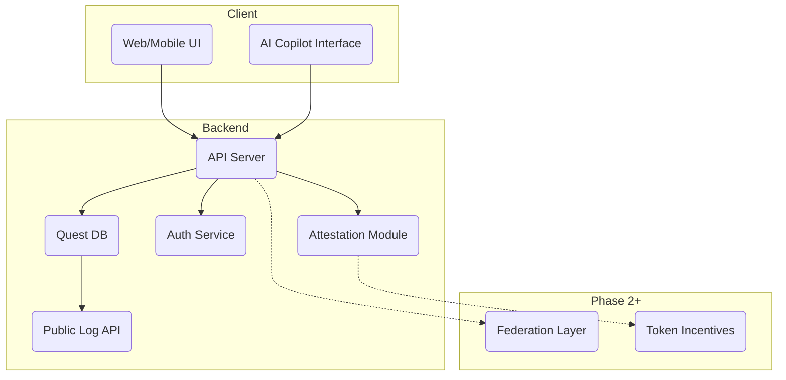

# CivicForge Implementation Plan

## Executive Summary
CivicForge aims to provide an open, verifiable quest network where community actions are recorded and dual-attested. The following plan translates the vision in the README into an actionable architecture and development roadmap for the initial 12-week sprint. The focus is a minimal viable product that demonstrates the 90-Second WOW, builds the core quest flow, and establishes secure, privacy-respecting foundations.

## Quest Schema Draft
The initial quest schema is captured in [`specs/quest-schema-v1.yaml`](../specs/quest-schema-v1.yaml). It models quests with fields for basic and exceptional completion criteria, privacy flags, and dual attestation timestamps.

```yaml
quest_id: uuid
world: string
creator_id: uuid
recipient_id: uuid
created_at: datetime
updated_at: datetime
status: string         # open | in_progress | completed | verified
privacy: string        # public | private

title: string
summary: string
basic_completion: string
exceptional_completion: string

due_date: date
location: string
attachments:
  - url: string
    description: string

attestation:
  actor_confirmed_at: datetime
  recipient_confirmed_at: datetime
  exceptional: boolean
  notes: string

metadata:
  tags: [string]
  ai_generated: boolean
  version: 1
```

## System Architecture

*Solid lines denote MVP data flow; dashed lines indicate future-phase integrations.* The API server manages quests, authentication, attestation, and exposes a read-only public log. The AI copilot assists quest creation from natural language. Future phases introduce cross-world federation and token incentives.

## Tech Stack Analysis
- **Backend:** Go or Rust offer strong performance and type safety. *Go* is recommended for faster team onboarding and a rich ecosystem of web tooling.
- **Frontend:** React provides extensive component libraries and accessibility tooling. *Svelte* offers smaller bundle sizes and simpler state management. React is preferred for hiring pool and ecosystem maturity.
- **Data Storage:** Use PostgreSQL with an append-only table for quests and attestation events. Leverage database-level immutable logs (e.g., `pg_audit`) for verifiability.
- **Authentication:** Start with OAuth2 (e.g., Auth0) for speed, with a roadmap to Passkeys/WebAuthn as adoption grows.
- **AI Integration:** Wrap OpenAI or open-source LLM behind a server endpoint. Keep prompts and responses logged for transparency. Phase 2 may explore local models for privacy.
## Quick Prototype Concept
A minimal prototype demonstrates the 90-Second WOW by guiding a user from quest creation to dual confirmation in one short flow.

1. **Landing Page** – simple React or Svelte page with sign-in and a text box.
2. **AI Copilot Endpoint** – converts natural text into a structured quest.
3. **In-Memory Storage** – temporary quest store for immediate feedback.
4. **Dual Confirmation** – recipient marks the quest done; both parties confirm.
5. **Public Log Preview** – list recently verified quests.

## Implementation Roadmap
### Weeks 1-4 (Detailed)
1. **Week 1**
   - Finalize quest schema and API spec
   - Set up repository CI/CD with basic Go server skeleton
   - Draft UI wireframes and 90-Second WOW flow
2. **Week 2**
   - Build quest CRUD endpoints and in-memory storage
   - Implement minimal React client for quest creation
   - Integrate AI copilot stub that turns plain text into quest fields
3. **Week 3**
   - Add dual attestation endpoints and append-only PostgreSQL
   - Implement OAuth2 login and session management
   - Conduct usability tests on WOW flow
4. **Week 4**
   - Launch World-Alpha with limited users
   - Collect metrics for WAU and churn
   - Begin moderation & delete-me API design

### Weeks 5-12 (High Level)
- **Weeks 5-6:** Scale quest storage, begin reputation points, improve AI suggestions.
- **Weeks 7-8:** Release reputation leaderboard; accessibility audit.
- **Weeks 9-10:** Implement moderation tools, finalize delete-me flow.
- **Weeks 11-12:** Publish docs, SDK stub, and onboarding guide for external contributors.

## Critical Path & Risks
- **Dual Attestation Flow** must function seamlessly; delays here block WAU targets.
- **AI Copilot Quality** may affect adoption; mitigate by allowing quick bypass.
- **Data Privacy**: Ensure delete-me service works from day one to avoid trust issues.
- **Limited Engineering Bandwidth**: Prioritize features that directly support verified actions. Defer federation and incentives until WAU > 5.

## Next Steps
1. Review and approve quest schema draft
2. Establish repo structure (`specs/`, `server/`, `web/`, `docs/`)
3. Implement Go API server scaffold with CI pipeline
4. Build minimal React interface and AI copilot stub
5. Run usability test of 90-Second WOW flow
