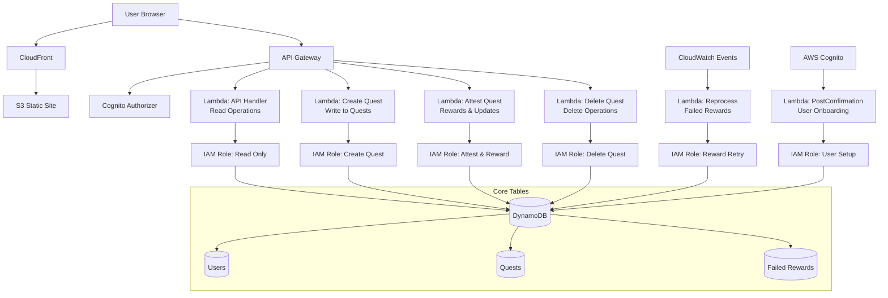
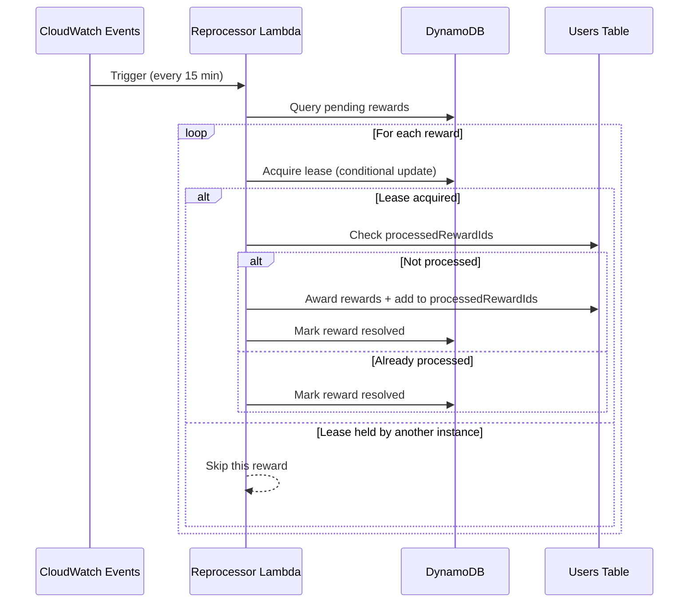

# CivicForge Architecture

## Core Mission & Principles

**Mission:** Enable peer-to-peer trust through dual-attestation of community quests.

**Principles:**
1. **Security over Performance** - Every attestation must be cryptographically verifiable
2. **Stateless by Default** - All state lives in DynamoDB, Lambdas are ephemeral
3. **Verifiability is Paramount** - The public must be able to audit completed quests

## System Architecture



## Core Flow: The Dual-Attestation Lifecycle

1. **Quest Creation**: A community member (requestor) creates a quest describing needed work
2. **Quest Claiming**: Another member (performer) claims the quest, committing to complete it
3. **Work Submission**: Performer completes the work and submits evidence
4. **Dual Attestation**: 
   - Performer attests: "I completed this work as specified"
   - Requestor attests: "The work meets my requirements"
5. **Completion**: When both attestations are recorded, the quest moves to COMPLETE status
6. **Rewards**: XP and reputation are awarded to the performer

### State Transitions

```
OPEN → CLAIMED → SUBMITTED → COMPLETE
         ↓           ↓
      EXPIRED    DISPUTED
```

## Security Architecture

### Handler Separation & IAM Roles

The system follows a **Zero Trust** security model where each Lambda function operates with the minimal permissions required:

| Lambda Function | IAM Permissions | Rationale |
|----------------|-----------------|-----------|
| **api** | `dynamodb:GetItem`, `Query`, `Scan`, `UpdateItem`. **Deny**: `DeleteItem`. | General read operations and non-critical state changes (claim, submit). Explicitly denies destructive actions. |
| **createQuest** | `dynamodb:GetItem` (Users), `UpdateItem` (Users), `PutItem` (Quests) | Creates quests and deducts creation points from the user. |
| **attestQuest** | `dynamodb:GetItem`, `UpdateItem` (Quests, Users), `PutItem` (FailedRewards) | Handles attestations, quest completion, and reward distribution. Can write to the failed rewards table. |
| **deleteQuest** | `dynamodb:GetItem`, `DeleteItem` (Quests), `UpdateItem` (Users) | Handles quest deletion and refunds points. The only function with `DeleteItem` permission. |

This separation ensures that even if one handler is compromised, the blast radius is limited to its specific permissions.

### CORS Configuration

The API uses explicit CORS headers to prevent unauthorized cross-origin requests:

```javascript
allowed_headers: [
    "Content-Type",
    "Authorization", 
    "X-Amz-Date",
    "X-Api-Key",
    "X-Amz-Security-Token"
]
```

No wildcards (`*`) are used in production to prevent CSRF attacks.

## Resiliency & Error Handling

### Failed Rewards Reprocessor

A critical component ensuring reliable reward distribution even when transient failures occur.

#### Problem Solved
When reward distribution fails (network issues, DynamoDB throttling, etc.), we need to ensure:
1. Rewards are eventually delivered
2. No double-awarding occurs
3. Multiple reprocessor instances don't conflict

#### Solution: Idempotency + Lease System



**Key Features:**
- **Idempotency**: Each reward has a unique ID tracked in user's `processedRewardIds`
- **Lease System**: Prevents concurrent processing with 5-minute leases
- **Retry Limits**: Abandons rewards after 5 failed attempts
- **Atomic Updates**: Uses DynamoDB conditional expressions

## Data Models

### User
```typescript
{
  userId: string;              // PK: Cognito sub
  username: string;
  walletAddress?: string;      // Ethereum address for signatures
  reputation: number;
  experience: number;
  questCreationPoints: number;
  processedRewardIds?: string[]; // Idempotency tracking
  createdAt: DateTime;
  updatedAt: DateTime;
}
```

### Quest
```typescript
{
  questId: string;             // PK: UUID
  status: QuestStatus;
  creatorId: string;
  performerId?: string;
  title: string;
  description: string;
  rewardXp: number;
  rewardReputation: number;
  attestations: Attestation[];
  
  // Denormalized for DynamoDB queries
  hasRequestorAttestation: boolean;
  hasPerformerAttestation: boolean;
  attesterIds?: Set<string>;
  
  createdAt: DateTime;
  claimedAt?: DateTime;
  submittedAt?: DateTime;
  completedAt?: DateTime;
}
```

### FailedReward
```typescript
{
  rewardId: string;            // PK
  questId: string;
  userId: string;
  xpAmount: number;
  reputationAmount: number;
  questPointsAmount: number;
  errorMessage: string;
  retryCount: number;
  status: "pending" | "resolved" | "abandoned";
  
  // Lease fields
  leaseOwner?: string;         // Lambda request ID
  leaseExpiresAt?: DateTime;
  
  createdAt: DateTime;
  lastRetryAt?: DateTime;
  resolvedAt?: DateTime;
}
```

### CI/CD Security

The deployment pipeline uses **OIDC (OpenID Connect)** for secure authentication between GitHub Actions and AWS:
- No long-lived AWS credentials stored in GitHub
- Temporary credentials scoped to deployment actions only
- Environment-specific trust relationships

## Key Technology Choices

### Why Serverless?
- **Scale to zero**: Community projects have variable load
- **No server management**: Focus on features, not infrastructure
- **Pay per use**: Keeps costs minimal for community-driven project
- **Granular security**: Each function has its own IAM role

### Why Modular Lambda Functions?
- **Least Privilege Security**: Each endpoint has exactly the permissions it needs
- **Independent Scaling**: High-traffic endpoints don't affect others
- **Fault Isolation**: Issues in one handler don't impact the entire API
- **Faster Cold Starts**: Smaller, focused functions start quicker
- **Easier Testing**: Each handler can be tested in isolation

### Why DynamoDB?
- **Single-table design**: All data in one table with GSIs for access patterns
- **Atomic transactions**: Critical for state transitions and attestations
- **Serverless-native**: No connection pooling issues with Lambda
- **Conditional expressions**: Enable idempotent operations

### Why TypeScript?
- **Type safety**: Prevents entire classes of bugs in distributed systems
- **Shared types**: Frontend and backend share the same interfaces
- **Developer experience**: Better IDE support and refactoring

### Why React 18 + Vite?
- **React 18**: Latest features including Suspense and concurrent rendering
- **Vite**: Lightning-fast HMR (Hot Module Replacement) for better DX
- **Modern Stack**: ESBuild for fast builds, native ES modules
- **Testing**: Vitest provides Jest-compatible API with better performance

## Performance Considerations

### Cold Starts
- Mitigation: Keep Lambda packages small by splitting handlers
- Consider provisioned concurrency for production if latency becomes an issue

### DynamoDB Throttling
- Auto-scaling configured for all tables
- Failed operations retry with exponential backoff
- Critical operations use the failed rewards queue for eventual consistency

### API Gateway Throttling
- Rate limit: 100 requests/second
- Burst: 200 requests
- Per-user quotas can be added if needed